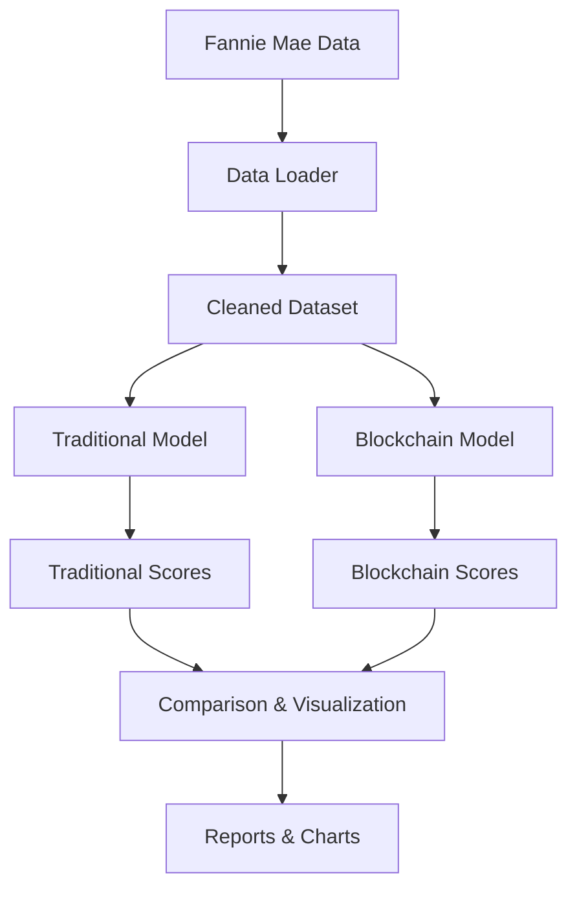

# 🏦 Securitization Comparison

A comprehensive Python framework for comparing **traditional securitization** with **tokenized/blockchain-based securitization** using real-world mortgage loan data.

[](https://www.python.org/downloads/)
[](https://python-poetry.org/)
[](https://github.com/psf/black)
[](https://github.com/charliermarsh/ruff)
[](https://github.com/python/mypy)

## 🎯 Overview

This project evaluates and compares two approaches to mortgage securitization across six key factors:

- **🔍 Transparency** - Public disclosure and data accessibility
- **💧 Liquidity** - Market depth and trading efficiency  
- **⚠️ Systemic Risk** - Concentration and interconnectedness risks
- **🏛️ Governance** - Decision-making and stakeholder participation
- **🔍 Auditing** - Verification and compliance mechanisms
- **🔗 Interoperability** - Cross-platform compatibility and standards

### Securitization Models

**Traditional Securitization**
- Rating agency assessments
- Limited transparency
- Regulated audit frameworks
- Proprietary data standards

**Blockchain/Tokenized Securitization**  
- On-chain transparency
- AMM-based liquidity
- Smart contract governance
- ERC standard compliance

## 🚀 Quick Start

### Prerequisites

- Python 3.11+
- [Poetry](https://python-poetry.org/docs/#installation) for dependency management

### Installation

```bash
# Clone the repository
git clone <repository-url>
cd securitization-comparison

# Install dependencies
poetry install

# Set up the project
make setup
```

## 🎲 New: Statistical Analysis

This framework now includes **Monte Carlo statistical analysis** to determine the probability that blockchain securitization outperforms traditional securitization across different parameter scenarios.

### What it does:
- Runs thousands of simulations with varying parameter combinations
- Tests different weight ranges from the YAML configuration files
- Calculates win probabilities and confidence intervals
- Provides factor-level performance analysis
- Exports detailed results for further analysis

### Key Features:
- **Sensitivity Analysis**: Tests how results change with different parameter assumptions
- **Probability Calculation**: Determines likelihood of blockchain outperforming traditional
- **Confidence Intervals**: Provides statistical confidence bounds
- **Factor-Level Analysis**: Shows which factors drive the results
- **Parallel Processing**: Uses multiple CPU cores for faster analysis

### Data Setup

1. Download Fannie Mae loan data (see [data/README.md](data/README.md))
2. Extract ZIP files to the `data/` directory

####


### Run Analysis
export PATH="/Users/lucabrulhart/.local/bin:$PATH" && poetry run streamlit run app.py --server.port=8501


#####

#### Option A: Interactive Web Application (Recommended)
```bash
# Launch the web interface
make webapp

# Or manually with poetry
poetry run streamlit run app.py
```
Then open your browser to `http://localhost:8501` for a beautiful interactive interface.

#### Option B: Command Line
```bash
# Basic comparison with 25k loan sample
make run

# Or with custom parameters
poetry run python scripts/compare.py --sample-size 50000 --debug
```

#### Option C: Statistical Analysis Demo
```bash
# Run Monte Carlo demo with 500 simulations
poetry run python scripts/statistical_demo.py

# Full statistical analysis (may take several minutes)
poetry run python scripts/compare.py --statistical-analysis --n-simulations 2000
```

## 📊 Usage Examples

### Command Line Interface

```bash
# Standard comparison
poetry run python scripts/compare.py

# Large dataset analysis
poetry run python scripts/compare.py --sample-size 100000

# With Monte Carlo statistical analysis
poetry run python scripts/compare.py --statistical-analysis --n-simulations 1000

# Custom configuration
poetry run python scripts/compare.py \
  --traditional-config my_trad_config.yaml \
  --blockchain-config my_chain_config.yaml \
  --output-dir custom_reports/

# Full analysis with statistics
poetry run python scripts/compare.py \
  --sample-size 50000 \
  --statistical-analysis \
  --n-simulations 2000 \
  --n-threads 8

# Debug mode with detailed logging
poetry run python scripts/compare.py --debug --no-cache
```

### Python API

```python
from securitization_comparison import (
    load_fannie_mae, 
    TraditionalModel, 
    BlockchainModel,
    plot_scores,
    run_statistical_analysis
)

# Load data
df = load_fannie_mae(sample_size=10000)

# Create models
traditional = TraditionalModel(df)
blockchain = BlockchainModel(df)

# Compute scores
trad_scores = traditional.compute_scores()
chain_scores = blockchain.compute_scores()

# Visualize results
plot_scores(trad_scores, chain_scores)

# Run statistical analysis
statistical_results = run_statistical_analysis(
    df, 
    n_simulations=1000, 
    n_threads=4
)

# Display win probability
summary = statistical_results["summary"]
print(f"Blockchain wins {summary['win_probability_percent']:.1f}% of the time")
```

### Jupyter Notebook Analysis

```python
import pandas as pd
from securitization_comparison import *

# Load and explore data
df = load_fannie_mae(sample_size=5000)
print(f"Loaded {len(df):,} loans")
df.head()

# Compare models
traditional = TraditionalModel(df)
blockchain = BlockchainModel(df)

scores_comparison = pd.DataFrame({
    'Traditional': traditional.compute_scores(),
    'Blockchain': blockchain.compute_scores()
})

scores_comparison['Difference'] = (
    scores_comparison['Blockchain'] - scores_comparison['Traditional']
)
print(scores_comparison)
```

## 🏗️ Architecture

### Project Structure

```
securitization-comparison/
├── securitization_comparison/          # Main package
│   ├── models/                        # Securitization models
│   │   ├── base.py                   # Abstract base class
│   │   ├── traditional.py            # Traditional model
│   │   ├── blockchain.py             # Blockchain model
│   │   ├── _traditional_weighting.yaml
│   │   └── _blockchain_weighting.yaml
│   ├── data_loader.py                # Fannie Mae data loader
│   └── viz.py                        # Visualization utilities
├── scripts/
│   └── compare.py                    # Main comparison script
├── tests/                            # Test suite
├── data/                             # Data directory
├── reports/figures/                  # Generated visualizations
├── pyproject.toml                    # Poetry configuration
├── Makefile                          # Build automation
└── README.md                         # This file
```

### Data Flow



## 📈 Factor Definitions

### Transparency (0-100)
**Traditional**: Base score + (% public disclosure × weight)
- Limited regulatory disclosures
- Proprietary rating methodologies

**Blockchain**: Fixed high score
- Full on-chain visibility
- Open-source smart contracts

### Liquidity (0-100)  
**Traditional**: Sigmoid function of estimated CPR
- Secondary market trading
- Dealer-based market making

**Blockchain**: Simulated AMM depth
- Automated market makers
- 24/7 trading availability

### Systemic Risk (0-100, inverted)
**Traditional**: Inverse of concentration + dispersion
- Geographic concentration
- Originator concentration

**Blockchain**: 100 - (oracle risk + smart contract risk)
- Oracle dependency
- Smart contract vulnerabilities

### Governance (0-100)
**Traditional**: Fixed moderate score
- Regulatory oversight
- Institutional decision-making

**Blockchain**: On-chain voting participation
- Token-based governance
- Decentralized proposals

### Auditing (0-100)
**Traditional**: Regulated audit score
- Periodic external audits
- Rating agency reviews

**Blockchain**: Real-time verification score
- Continuous on-chain verification
- Proof-of-reserve mechanisms

### Interoperability (0-100)
**Traditional**: 100 - proprietary penalty
- Proprietary data formats
- Limited cross-platform compatibility

**Blockchain**: ERC standard compliance
- Standardized token interfaces
- Cross-chain compatibility

## ⚙️ Configuration

Models can be customized using YAML configuration files:

### Traditional Model (`_traditional_weighting.yaml`)
```yaml
transparency:
  base_score: 30
  disclosure_weight: 70
  
liquidity:
  cpr_alpha: 5.0
  cpr_scale: 0.1
  
# ... other factors
```

### Blockchain Model (`_blockchain_weighting.yaml`)
```yaml
transparency:
  on_chain_score: 90
  
liquidity:
  amm_depth_shape: 2.0
  amm_depth_scale: 0.8
  
# ... other factors
```

## 🧪 Testing

```bash
# Run all tests
make test

# Run specific test categories
poetry run pytest tests/test_models.py -v
poetry run pytest tests/test_data_loader.py -v

# Run with coverage
poetry run pytest --cov=securitization_comparison
```

## 🔧 Development

### Code Quality

```bash
# Format code
make format

# Lint code  
make lint

# Type checking
make typecheck

# All quality checks
make lint && make typecheck && make test
```

### Contributing

1. **Fork** the repository
2. **Create** a feature branch (`git checkout -b feature/amazing-feature`)
3. **Make** your changes with tests
4. **Ensure** all quality checks pass (`make lint typecheck test`)
5. **Commit** your changes (`git commit -m 'Add amazing feature'`)
6. **Push** to the branch (`git push origin feature/amazing-feature`)
7. **Open** a Pull Request

## 📋 Requirements

### Production Dependencies
- **pandas** (≥2.1.0) - Data manipulation
- **numpy** (≥1.24.0) - Numerical computing  
- **matplotlib** (≥3.7.0) - Static plotting
- **plotly** (≥5.15.0) - Interactive visualizations
- **scikit-learn** (≥1.3.0) - ML utilities
- **pyyaml** (≥6.0.1) - Configuration files
- **tqdm** (≥4.65.0) - Progress bars

### Development Dependencies
- **pytest** (≥7.4.0) - Testing framework
- **ruff** (≥0.0.280) - Linting
- **black** (≥23.7.0) - Code formatting
- **mypy** (≥1.5.0) - Type checking

## 📊 Sample Output

```
================================================================================
SECURITIZATION COMPARISON RESULTS
================================================================================

Dataset: 25,000 loans
Data source: data

Traditional Securitization Scores:
  Transparency        :   53.3
  Liquidity          :   72.1
  Systemic Risk      :   45.8
  Governance         :   50.0
  Auditing           :   60.0
  Interoperability   :   40.0

Blockchain Securitization Scores:
  Transparency        :   90.0
  Liquidity          :   68.4
  Systemic Risk      :   78.2
  Governance         :   65.3
  Auditing           :   80.0
  Interoperability   :   85.0

Score Differences (Blockchain - Traditional):
  Transparency        :  +36.7
  Liquidity          :   -3.7
  Systemic Risk      :  +32.4
  Governance         :  +15.3
  Auditing           :  +20.0
  Interoperability   :  +45.0

  TOTAL              : +145.7

Overall Winner: Blockchain
================================================================================

Visualization files saved to: reports/figures
```

## 🎨 Visualizations

The framework generates several types of visualizations:

1. **Radar Chart** - Overall factor comparison
2. **Bar Charts** - Side-by-side factor scores  
3. **Difference Analysis** - Blockchain vs Traditional gaps
4. **Interactive Dashboard** - Plotly-based exploration
5. **Summary Table** - Tabular comparison with winners

## ⚠️ Limitations & Caveats

### Model Assumptions
- **Heuristic-based scoring**: Scores are based on reasonable assumptions, not empirical studies
- **Simulated blockchain metrics**: Some blockchain scores use simulation due to limited real-world data
- **Static analysis**: Does not account for market conditions or regulatory changes

### Data Limitations  
- **Historical data**: Fannie Mae data reflects past lending practices
- **US mortgage focus**: Results may not generalize to other asset classes or geographies
- **Sample bias**: Fannie Mae loans may not represent the entire mortgage market

### Interpretation Guidelines
- **Relative comparison**: Focus on relative differences rather than absolute scores
- **Factor weighting**: Consider adjusting factor weights based on your priorities
- **Sensitivity analysis**: Test different configurations and sample sizes

## 🚧 Future Enhancements (TODOs)

### Planned Features
- [ ] **Real blockchain data integration** (Dune Analytics API)
- [ ] **Streamlit dashboard** with adjustable weights
- [ ] **Monte Carlo stress testing** for systemic risk
- [ ] **Additional asset classes** (auto loans, credit cards)
- [ ] **Regulatory impact modeling**
- [ ] **ESG factor integration**

### Technical Improvements
- [ ] **Distributed computing** support for large datasets
- [ ] **Database backend** for persistent storage  
- [ ] **API endpoints** for web integration
- [ ] **Docker containerization**
- [ ] **CI/CD pipeline** with automated testing

## 📜 License

This project is licensed under the MIT License - see the [LICENSE](LICENSE) file for details.

## 🙏 Acknowledgments

- **Fannie Mae** for providing publicly available loan performance data
- **Python community** for excellent data science libraries
- **DeFi protocols** for inspiring blockchain securitization approaches

## 📞 Support

- **Issues**: Report bugs and request features via [GitHub Issues](https://github.com/your-repo/issues)
- **Discussions**: Join conversations in [GitHub Discussions](https://github.com/your-repo/discussions)
- **Documentation**: Full API docs available in the `docs/` directory

---

**Made with ❤️ for the intersection of traditional finance and blockchain innovation** 